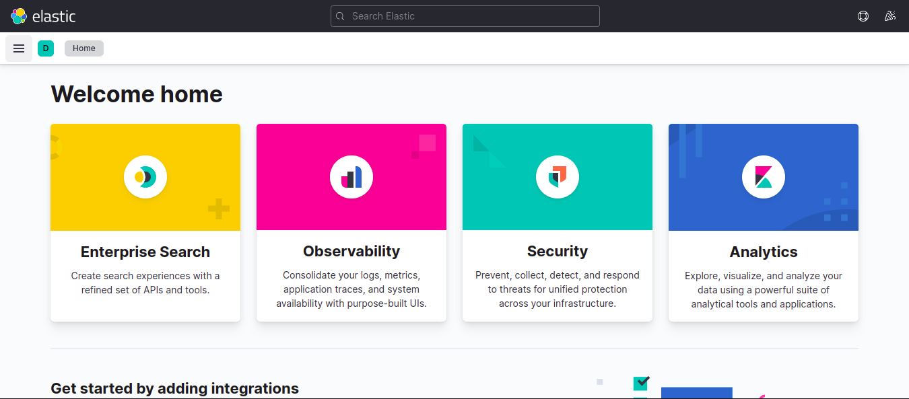

# Elasticsearch

```
curl -fsSL https://artifacts.elastic.co/GPG-KEY-elasticsearch | sudo apt-key add -

echo "deb https://artifacts.elastic.co/packages/7.x/apt stable main" | sudo tee -a /etc/apt/sources.list.d/elastic-7.x.list

sudo apt update

sudo apt install elasticsearch

sudo systemctl start elasticsearch

sudo systemctl enable elasticsearch
```

## Configuration

Edit the configuration files and perform the following changes.

```
sudo nano /etc/elasticsearch/elasticsearch.yml

cluster.name: first-cluster

network.host: localhost

http.port: 9200

===== Only if you need CORS =====

http.cors.enabled: true
http.cors.allow-origin: "https://app.elasticvue.com"  ... Or any other site name
http.cors.allow-headers: X-Requested-With,Content-Type,Content-Length,Authorization

```

# Kibana

```
sudo apt install kibana nginx

sudo systemctl enable kibana

sudo systemctl start kibana
```

The following command will create the administrative Kibana user and password, and store them in the htpasswd.users file. You will configure Nginx to require this username and password and read this file momentarily:

```
echo "<admin_username>:`openssl passwd -apr1`" | sudo tee -a /etc/nginx/htpasswd.users
```

## Configure NGINX as reverse proxy for Kibana

```
sudo nano /etc/nginx/conf.d/<your_domain>.conf
```

Add the following server block:

```
server {
    listen 80;

    server_name <your_domain>;

    auth_basic "Restricted Access";
    auth_basic_user_file /etc/nginx/htpasswd.users;

    location / {
        proxy_pass http://localhost:5601;
        proxy_http_version 1.1;
        proxy_set_header Upgrade $http_upgrade;
        proxy_set_header Connection 'upgrade';
        proxy_set_header Host $host;
        proxy_cache_bypass $http_upgrade;
    }
}
```

[](Kibana)